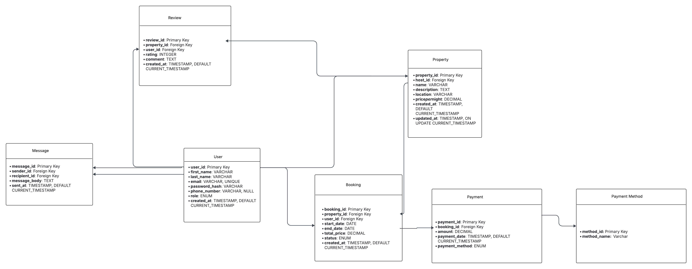

# Airbnb Database - Normalized ERD (3NF)

## Objective
To refine the original ERD by applying **Third Normal Form (3NF)** principles to reduce data redundancy and improve data integrity.

## Key Changes from Original ERD
- Created a separate `PaymentMethod` table instead of storing payment types directly in the `Payment` table.
- Removed repeating groups from `Booking` and `Property` tables.
- Ensured that every non-key attribute depends **only** on the primary key.

## Updated ERD

## Normalization Summary
The updated design now meets **3NF** by:
1. Eliminating repeating groups (1NF).
2. Removing partial dependencies (2NF).
3. Removing transitive dependencies (3NF).
